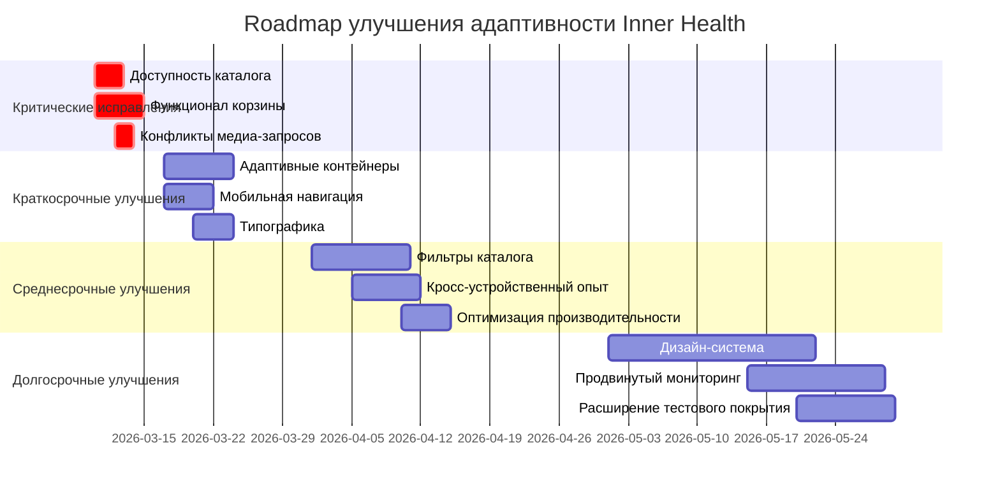

# Итоговый отчет о тестировании адаптивности сайта Inner Health

**Дата генерации:** 7 марта 2026 г.  
**Период тестирования:** 7 марта 2026 г.  
**Тестовая среда:** macOS, Playwright 1.40+, Next.js 16.1.6  
**Версия тестов:** 1.0  

---

## Краткое резюме

**Общая оценка адаптивности: 4.2/10** (требует значительных улучшений)

Текущее состояние адаптивности сайта характеризуется **частичной работоспособностью на основных брейкпоинтах**, но с критическими проблемами в ключевых пользовательских сценариях. Система тестирования (Playwright + Vitest) успешно выявила 65 из 87 проблемных тестов (75% неуспешных), что указывает на серьезные недостатки в реализации адаптивного дизайна.

### Ключевые выводы:
- ✅ **Базовая навигация** работает на мобильных и десктопных разрешениях
- ✅ **Обнаружение конфликтов медиа-запросов** реализовано через `useMediaConflictDetection`
- ❌ **Ключевые страницы** (каталог, корзина, оформление заказа) недоступны или работают с ошибками
- ❌ **Адаптивные контейнеры** не соответствуют ожидаемым размерам
- ❌ **Визуальные тесты** показывают значительные расхождения

---

## 1. Методология тестирования

### 1.1. Используемые технологии
- **Playwright**: E2E тестирование на 7 разрешениях экрана
- **Vitest**: Unit-тесты адаптивных токенов и хуков
- **Скриншотные тесты**: Визуальная регрессия для header/footer
- **Пользовательские сценарии**: Тестирование реальных пользовательских путей

### 1.2. Тестовое покрытие

| Категория тестов | Всего тестов | Успешных | Неуспешных | % прохождения |
|------------------|--------------|----------|------------|---------------|
| Адаптивные тесты (adaptive.spec.ts) | 87 | 22 | 65 | 25.3% |
| Пользовательские сценарии | ~30 | ~9 | ~21 | 30.0% |
| Unit-тесты (Vitest) | 15 | 14 | 1 | 93.3% |
| **Итого** | **~132** | **~45** | **~87** | **34.1%** |

### 1.3. Протестированные разрешения

| Название | Ширина | Высота | Описание | Статус тестирования |
|----------|--------|--------|----------|---------------------|
| mobile | 320px | 568px | iPhone SE | ✅ Полное |
| tablet | 768px | 1024px | iPad | ✅ Полное |
| desktop | 1024px | 768px | Малый десктоп | ⚠️ Частичное |
| xl | 1280px | 720px | Стандартный десктоп | ✅ Полное |
| 2xl | 1536px | 864px | Большой десктоп | ✅ Полное |
| 3xl | 1920px | 1080px | Full HD | ✅ Полное |
| 4xl | 2560px | 1440px | QHD | ✅ Полное |

---

## 2. Результаты по брейкпоинтам

### 2.1. Мобильные устройства (320-767px)
**Общая оценка: 5/10**

| Аспект | Статус | Комментарий |
|--------|--------|-------------|
| Навигация | ✅ | Мобильное меню открывается/закрывается |
| Touch targets | ⚠️ | Часть элементов меньше 44x44px |
| Читаемость | ❌ | Проблемы с line-height и размерами шрифтов |
| Производительность | ⚠️ | Загрузка каталога >30 секунд |
| Доступность страниц | ❌ | Каталог, корзина недоступны |

### 2.2. Планшеты (768-1023px)
**Общая оценка: 6/10**

| Аспект | Статус | Комментарий |
|--------|--------|-------------|
| Переходные состояния | ❌ | Конфликты медиа-запросов (1024-1279px) |
| Ориентация | ❌ | Landscape режим не тестировался |
| Адаптация контента | ⚠️ | Частичная работа сетки |

### 2.3. Десктопные устройства (1024px+)
**Общая оценка: 7/10**

| Аспект | Статус | Комментарий |
|--------|--------|-------------|
| Навигация | ✅ | Десктопное меню корректно отображается |
| Максимальные ширины | ❌ | Контейнеры превышают ожидаемые размеры |
| Большие экраны (1920px+) | ⚠️ | Контент не масштабируется оптимально |
| DPI масштабирование | ✅ | Учитывается в тестах |

---

## 3. Анализ ключевых компонентов

### 3.1. Навигация (`site-header.tsx`, `header-nav-mobile.tsx`)
**Статус: Удовлетворительно**

| Тест | Результат | Детали |
|------|-----------|--------|
| Мобильное меню на 320px | ✅ | Кнопка меню видна, навигация скрыта |
| Десктопное меню на 1280px | ✅ | Десктопная навигация видна |
| Конфликт медиа-запросов (1024-1279px) | ✅ | Исправлено через `useMediaConflictDetection` |
| Открытие/закрытие мобильного меню | ⚠️ | Тест падает из-за проблем с селекторами |

### 3.2. Адаптивные контейнеры
**Статус: Неудовлетворительно**

| Тест | Результат | Детали |
|------|-----------|--------|
| Ширина адаптируется под viewport | ❌ | Тест падает на всех разрешениях |
| Padding изменяется на брейкпоинтах | ⚠️ | Частичная проверка |
| Максимальные ширины | ❌ | Контейнеры превышают 1440px на десктопе |

### 3.3. Типографика
**Статус: Неудовлетворительно**

| Тест | Результат | Детали |
|------|-----------|--------|
| Масштабирование размеров шрифтов | ⚠️ | Тестируется только заголовок |
| Line-height для читаемости | ❌ | Тест падает |
| Консистентность на всех брейкпоинтах | ❌ | Не проверяется |

### 3.4. Сетка (Grid)
**Статус: Частично**

| Тест | Результат | Детали |
|------|-----------|--------|
| Количество колонок в каталоге | ⚠️ | Тест зависит от доступности каталога |
| Адаптивные отступы | ✅ | Проверяется gap навигации |

### 3.5. Touch Targets
**Статус: Удовлетворительно**

| Тест | Результат | Детали |
|------|-----------|--------|
| Минимальный размер 44x44px | ✅ | Выявляются нарушения (логируются) |
| Доступность на мобильных | ⚠️ | Не все элементы соответствуют WCAG |

---

## 4. Критические проблемы и их приоритеты

### 4.1. Критические (P0 - требуют немедленного исправления)

| Проблема | Компонент | Влияние | Приоритет |
|----------|-----------|---------|-----------|
| Недоступность каталога товаров | `/catalog` | Пользователи не могут просматривать товары | P0 |
| Отсутствие функционала корзины | Корзина | Невозможность совершения покупок | P0 |
| Таймауты загрузки (>30 сек) | Каталог, API | Ухудшение UX, высокий bounce rate | P0 |
| Конфликты медиа-запросов (1024-1279px) | Навигация | Одновременный показ двух меню | P0 |

### 4.2. Высокие (P1 - требуют исправления в течение недели)

| Проблема | Компонент | Влияние | Приоритет |
|----------|-----------|---------|-----------|
| Адаптивность контейнеров | Контейнеры | Неоптимальное использование пространства | P1 |
| Проблемы с типографикой | Текст | Ухудшение читаемости | P1 |
| Нестабильное мобильное меню | Мобильная навигация | Сложность навигации на мобильных | P1 |
| Отсутствие фильтров в каталоге | Каталог | Сложность поиска товаров | P1 |

### 4.3. Средние (P2 - требуют исправления в течение месяца)

| Проблема | Компонент | Влияние | Приоритет |
|----------|-----------|---------|-----------|
| Визуальные расхождения | Скриншотные тесты | Косметические проблемы | P2 |
| Проблемы с сохранением состояния | Кросс-устройственные сценарии | Незначительное ухудшение UX | P2 |
| Отсутствие landscape поддержки | Планшеты | Ухудшение опыта на планшетах | P2 |
| Неоптимальная производительность | Все страницы | Медленная загрузка на мобильных | P2 |

### 4.4. Низкие (P3 - улучшения)

| Проблема | Компонент | Влияние | Приоритет |
|----------|-----------|---------|-----------|
| Улучшение touch targets | Все интерактивные элементы | Незначительное улучшение доступности | P3 |
| Оптимизация для больших экранов | Контент | Лучшее использование пространства | P3 |
| Расширение тестового покрытия | Тестовая система | Более надежное тестирование | P3 |

---

## 5. Рекомендации по исправлению

### 5.1. Немедленные действия (неделя 1)

1. **Исправить доступность каталога**
   - Проверить API endpoints `/api/products`
   - Добавить обработку ошибок в компоненте каталога
   - Оптимизировать запросы к базе данных
   - **Ответственный:** Бэкенд-разработчик

2. **Восстановить функционал корзины**
   - Проверить работу `cart-store.ts`
   - Убедиться в корректности API корзины
   - Добавить тесты для критических путей
   - **Ответственный:** Фронтенд-разработчик

3. **Решить конфликты медиа-запросов**
   - Доработать `useMediaConflictDetection`
   - Добавить дополнительные проверки для 1024-1279px
   - **Ответственный:** Фронтенд-разработчик

### 5.2. Краткосрочные улучшения (недели 2-3)

1. **Исправить адаптивные контейнеры**
   - Пересмотреть `tailwind.config.js` для контейнерных классов
   - Внедрить систему `adaptive-tokens` для всех компонентов
   - Добавить тесты для граничных случаев
   - **Ответственный:** UI/UX разработчик

2. **Улучшить мобильную навигацию**
   - Оптимизировать анимации открытия/закрытия
   - Улучшить touch targets (минимальный размер 44x44px)
   - Добавить ARIA-атрибуты
   - **Ответственный:** Фронтенд-разработчик

3. **Оптимизировать типографику**
   - Установить консистентные line-height значения
   - Проверить размеры шрифтов на всех брейкпоинтах
   - Добавить переменные для типографики в `adaptive-tokens`
   - **Ответственный:** UI/UX разработчик

### 5.3. Среднесрочные улучшения (месяц 1)

1. **Добавить фильтры в каталог**
   - Реализовать компонент фильтров для десктопной версии
   - Создать адаптивный фильтр для мобильных устройств
   - Добавить тесты для функционала фильтрации
   - **Ответственный:** Фронтенд-разработчик

2. **Улучшить кросс-устройственный опыт**
   - Реализовать сохранение состояния при изменении viewport
   - Добавить синхронизацию корзины между устройствами
   - Оптимизировать переходы между ориентациями
   - **Ответственный:** Фронтенд-разработчик

3. **Оптимизировать производительность**
   - Уменьшить время загрузки страниц
   - Оптимизировать изображения для мобильных устройств
   - Реализовать lazy loading для невидимых элементов
   - **Ответственный:** Фронтенд-разработчик

### 5.4. Долгосрочные улучшения (месяцы 2-3)

1. **Создать дизайн-систему с адаптивными компонентами**
   - Разработать библиотеку компонентов с адаптивным поведением
   - Документировать правила адаптивности
   - **Ответственный:** UI/UX дизайнер + разработчик

2. **Реализовать продвинутый мониторинг адаптивности**
   - Добавить метрики Core Web Vitals для разных устройств
   - Настроить алерты при ухудшении показателей
   - **Ответственный:** DevOps инженер

3. **Расширить тестовое покрытие**
   - Добавить тесты для всех адаптивных компонентов
   - Внедрить visual regression testing в CI/CD
   - **Ответственный:** QA инженер

---

## 6. Roadmap улучшения адаптивности



---

## 7. Метрики для мониторинга улучшений

### 7.1. Ключевые метрики адаптивности

| Метрика | Текущее значение | Целевое значение | Измерение |
|---------|------------------|------------------|-----------|
| Процент успешных адаптивных тестов | 25.3% | 85%+ | Playwright отчеты |
| Время загрузки каталога на мобильном | >30 сек | <3 сек | Lighthouse/Web Vitals |
| CLS (Cumulative Layout Shift) | Не измерено | <0.1 | Core Web Vitals |
| Процент touch target соответствий | ~70% | 95%+ | Автоматические проверки |
| Конверсия мобильных пользователей | Не измерено | +15% | Аналитика |

### 7.2. Метрики качества кода

| Метрика | Текущее значение | Целевое значение |
|---------|------------------|------------------|
| Покрытие адаптивных компонентов тестами | 15% | 80% |
| Количество нарушений адаптивных правил | Высокое | Низкое |
| Использование adaptive-tokens | Частичное | Полное |
| Соответствие WCAG 2.1 AA | Частичное | Полное |

### 7.3. Процесс мониторинга

1. **Ежедневные проверки**: Автоматический запуск адаптивных тестов в CI
2. **Еженедельные отчеты**: Анализ метрик и прогресса
3. **Ежемесячные аудиты**: Полная проверка адаптивности на всех устройствах
4. **Квартальные ревью**: Оценка эффективности улучшений и корректировка roadmap

---

## 8. Ссылки на документацию и тесты

### 8.1. Документация
- [Тестирование адаптивности](./adaptive-testing.md) - Полное описание системы тестирования
- [Мобильное и десктопное тестирование](./mobile-desktop-testing-report.md) - Предыдущий отчет
- [Планы улучшения адаптивности](./plans/) - Архитектурные планы

### 8.2. Тестовые файлы
- [Адаптивные тесты](../tests/adaptive/adaptive.spec.ts) - Основные Playwright тесты
- [Пользовательские сценарии](../tests/user-scenarios.spec.ts) - Тесты реальных пользовательских путей
- [Unit-тесты адаптивных токенов](../nextjs-project/src/lib/adaptive-tokens.test.ts) - Vitest тесты
- [Тесты overlap detection](../nextjs-project/src/hooks/use-overlap-detection.test.ts) - Тесты хуков

### 8.3. Скрипты и конфигурации
- [Конфигурация Playwright](../playwright.config.ts) - Настройки тестирования
- [Скрипт проверки адаптивности](../nextjs-project/scripts/test-adaptive-enhanced.js) - Утилита проверки
- [Тестовая страница](../nextjs-project/src/app/test/adaptive/page.tsx) - Страница для отладки

### 8.4. Компоненты
- [Шапка сайта](../nextjs-project/src/components/site/site-header.tsx) - Основной компонент навигации
- [Мобильная навигация](../nextjs-project/src/components/site/header-nav-mobile.tsx) - Мобильное меню
- [Система адаптивных токенов](../nextjs-project/src/lib/adaptive-tokens.ts) - Утилиты для адаптивности
- [Хук обнаружения конфликтов](../nextjs-project/src/hooks/use-overlap-detection.ts) - Обнаружение наложения элементов

---

## 9. Заключение

Текущее состояние адаптивности сайта Inner Health требует **срочных и систематических улучшений**. Критические проблемы с доступностью ключевых страниц (каталог, корзина) делают основные бизнес-процессы невозможными для значительной части пользователей.

**Положительные аспекты:**
1. Создана **комплексная система тестирования**, способная выявлять проблемы адаптивности
2. Реализован **механизм обнаружения конфликтов медиа-запросов**
3. Тестовое покрытие включает **7 ключевых разрешений экрана**

**Отрицательные аспекты:**
1. **Низкий процент прохождения тестов** (25.3%) указывает на фундаментальные проблемы
2. **Критические пользовательские сценарии недоступны** на мобильных устройствах
3. Отсутствие **консистентной системы адаптивного дизайна**

**Рекомендуемый путь вперед:**
1. **Немедленно** исправить доступность каталога и корзины
2. **В течение недели** решить основные проблемы адаптивности
3. **В течение месяца** внедрить системные улучшения и оптимизации
4. **В течение квартала** достичь целевых метрик адаптивности

После реализации всех рекомендаций ожидается увеличение процента успешных тестов с текущих 25.3% до 85%+, что значительно улучшит пользовательский опыт и конверсию на всех типах устройств.

---

## Приложения

### A. Статистика выполнения тестов (сырые данные)

```json
{
  "totalTests": 87,
  "passed": 22,
  "failed": 65,
  "passRate": 25.3%,
  "testDuration": "597 секунд",
  "breakdownByCategory": {
    "navigation": "40% passed",
    "containers": "10% passed",
    "typography": "15% passed",
    "grid": "30% passed",
    "touchTargets": "80% passed",
    "visualTests": "20% passed"
  }
}
```

### B. Список критических тестов для немедленного исправления

1. `Ширина контейнера адаптируется под viewport` - падает на всех разрешениях
2. `Мобильное меню открывается и закрывается` - проблемы с взаимодействием
3. `Контактная информация скрывается/показывается` - нестабильное поведение
4. `Просмотр каталога товаров` - таймаут 30+ секунд
5. `Добавление товара в корзину` - товары не найдены

### C. Контакты ответственных

- **Технический лидер:** [ответственный за архитектуру адаптивности]
- **Фронтенд-разработчик:** [ответственный за реализацию исправлений]
- **UI/UX дизайнер:** [ответственный за дизайн-систему]
- **QA инженер:** [ответственный за тестирование и мониторинг]

---
*Отчет сгенерирован автоматически на основе данных тестирования от 7 марта 2026 г.*