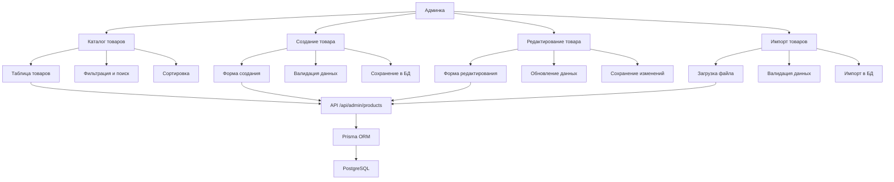

# Структура админки управления товарами

Общий ТЗ и статус: [adminv2.md](./adminv2.md), [STATUS.md](./STATUS.md). Ниже — структура каталога и страниц.

## Обзор

Админка управления товарами представляет собой часть административной панели сайта, предназначенную для управления каталогом товаров. В текущей реализации она включает в себя функции просмотра, добавления, редактирования и импорта товаров.

## Архитектурная структура

### Основные директории и файлы

```
nextjs-project/src/app/admin/
├── layout.tsx                 # Основной layout админки с авторизацией
├── page.tsx                  # Главная страница админки (перенаправляет на каталог)
├── catalog/                  # Модуль управления каталогом
│   ├── page.tsx              # Главная страница каталога с таблицей товаров
│   ├── actions.ts            # Серверные действия для каталога
│   └── components/
│       ├── ProductTable.tsx  # Компонент таблицы товаров
│       └── ImportSection.tsx # Компонент импорта товаров
├── products/                 # Модуль управления товарами
│   ├── page.tsx              # Список товаров
│   ├── new/                  # Создание нового товара
│   │   ├── page.tsx          # Страница создания товара
│   │   └── actions.ts        # Серверные действия для создания
│   ├── [id]/                 # Детали товара
│   │   └── page.tsx          # Страница деталей товара
│   ├── [id]/edit/            # Редактирование товара
│   │   └── page.tsx          # Страница редактирования товара
│   └── import/               # Импорт товаров
│       ├── page.tsx          # Страница импорта
│       └── actions.ts        # Серверные действия для импорта
└── components/               # Общие компоненты админки
    ├── AdminNav.tsx          # Навигация админки
    └── ProfileMenu.tsx       # Меню профиля пользователя
```

## Основные страницы и компоненты

### 1. Главная страница каталога (`/admin/catalog`)
- Отображает таблицу всех товаров
- Позволяет фильтровать и сортировать товары
- Кнопки для создания новых товаров и импорта
- Реализует пагинацию и поиск

### 2. Страница создания нового товара (`/admin/products/new`)
- Форма для добавления нового товара
- Поля для основных характеристик:
  - Название
  - Цена
  - Описание
  - Изображения
  - Категория
  - Подкатегория
  - Вес, размеры
  - SKU
  - Количество на складе
  - Теги
  - Старая цена и цена со скидкой

### 3. Страница редактирования товара (`/admin/products/[id]/edit`)
- Форма редактирования существующего товара
- Все поля, доступные при создании
- Возможность загрузки новых изображений
- Сохранение изменений

### 4. Страница импорта товаров (`/admin/products/import`)
- Возможность импорта товаров из CSV/Excel
- Предварительный просмотр импортируемых данных
- Валидация данных перед импортом
- Обработка ошибок импорта

## Структура данных товаров (Prisma Schema)

```prisma
model Product {
  id                              String    @id @default(cuid())
  tildaUid                        String    @unique
  brand                           String?
  sku                             String?
  mark                            String?
  category                        String?
  title                           String
  description                     String?
  text                            String?
  photo                           String?
  price                           Float
  quantity                        Int?
  priceOld                        Float?
  editions                        String?
  modifications                   String?
  externalId                      String?
  parentUid                       String?
  characteristicsNutrition100g    String?
  characteristicsKkal             String?
  characteristicsContraindications String?
  characteristicsShelfLife        String?
  characteristicsShelfLife2       String?
  characteristicsNutrition100gProduct String?
  characteristicsEnergyValue100g  String?
  characteristicsNutrition100g2   String?
  characteristicsNutritionPerPortion5g String?
  characteristicsComposition      String?
  characteristicsKkal100gDailyDose String?
  characteristicsFormulation      String?
  characteristicsCalorie          String?
  characteristicsFlacon200ml      String?
  characteristicsStorage          String?
  weight                          Int?
  length                          Int?
  width                           Int?
  height                          Int?
  seoTitle                        String?
  seoDescr                        String?
  seoKeywords                     String?
  fbTitle                         String?
  fbDescr                         String?
  tab1                            String?
  tab2                            String?
  tab3                            String?
  tab4                            String?
  createdAt                       DateTime  @default(now())
  updatedAt                       DateTime  @updatedAt
  cartItems                       CartItem[]
  orderItems                      OrderItem[]
}
```

## API Endpoints

### Основные endpoint'ы

1. **GET `/api/admin/products`** - Получение списка товаров
2. **GET `/api/admin/products?id={id}`** - Получение конкретного товара
3. **POST `/api/admin/products`** - Создание нового товара
4. **PUT `/api/admin/products/{id}`** - Обновление товара
5. **DELETE `/api/admin/products/{id}`** - Удаление товара
6. **POST `/api/admin/products/upload-image`** - Загрузка изображения товара
7. **POST `/api/admin/products/upload-image-from-url`** - Загрузка изображения по URL

## Возможности управления товарами

### Основные функции:
1. **Просмотр каталога** - Отображение всех товаров в таблице с возможностью фильтрации и сортировки
2. **Создание товаров** - Полная форма добавления нового товара
3. **Редактирование товаров** - Изменение существующих товаров
4. **Удаление товаров** - Удаление товаров из каталога
5. **Импорт товаров** -批量 импорт товаров из внешних источников
6. **Управление изображениями** - Загрузка и управление изображениями товаров
7. **Фильтрация и поиск** - Поиск по различным параметрам товаров

### Дополнительные функции:
1. **SEO-оптимизация** - Настройка SEO-заголовков и мета-тегов
2. **Система тегов** - Управление тегами для категоризации товаров
3. **Скидки и акции** - Установка цен со скидками
4. **Характеристики** - Указание различных характеристик товаров
5. **Категории и подкатегории** - Иерархическая структура категорий

## Диаграмма архитектуры



## Технические особенности

### Авторизация
- Админка защищена авторизацией через NextAuth
- Только пользователи с ролью ADMIN могут получить доступ
- Используется middleware для проверки сессии

### Валидация данных
- Клиентская валидация форм
- Серверная валидация данных перед сохранением
- Обработка ошибок и отображение сообщений об ошибках

### Работа с изображениями
- Загрузка изображений через API
- Поддержка загрузки по URL
- Хранение изображений в публичной директории

### Отслеживание изменений
- Автоматическое обновление времени изменения (updatedAt)
- Логирование операций с товарами

## Масштабируемость

### Возможности расширения:
1. Добавление новых полей в модель Product
2. Расширение функционала импорта (поддержка других форматов)
3. Добавление фильтров и сортировок
4. Интеграция с системами управления запасами
5. Добавление групповой работы с товарами
6. Расширение системы тегов и категорий

### Потенциальные улучшения:
1. Добавление версионирования товаров
2. Внедрение системы комментариев к товарам
3. Добавление возможности массового редактирования
4. Интеграция с CRM-системами
5. Добавление аналитики по продажам товаров